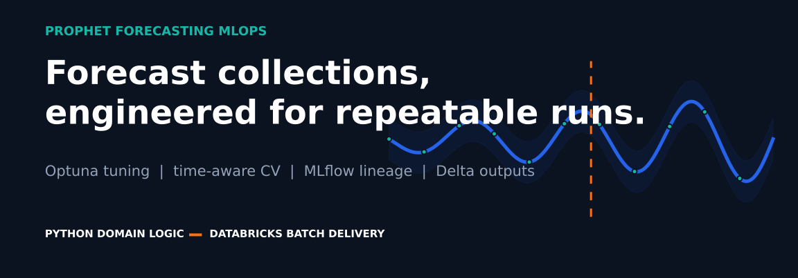
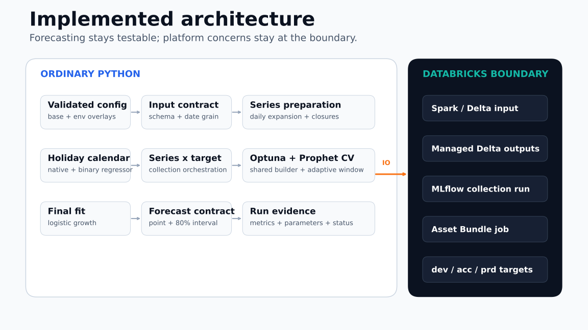
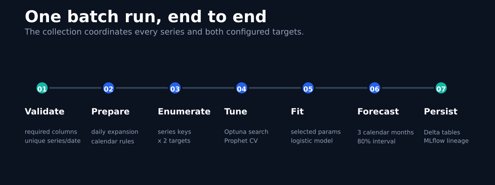
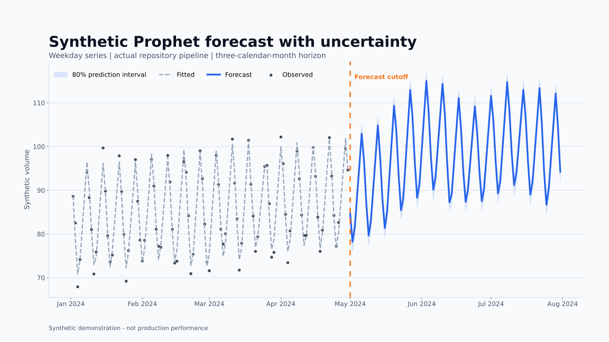

<div align="center">

[](https://github.com/soulipaco/prophet-forecasting-mlops/actions/workflows/ci.yml)


</div>

# Prophet Forecasting MLOps

A production-oriented batch forecasting reference for coordinating Prophet model collections on
Databricks. The project keeps forecasting behavior in testable Python while Spark/Delta IO, MLflow
tracking, and job delivery remain at a narrow platform boundary.

## The one-minute view

The pipeline discovers the series present in its input and fits both configured targets for each
series. Every fit follows the same validated path: daily preparation, calendar and regressor
construction, adaptive time-aware cross-validation, Optuna parameter search, final Prophet fit, and
a three-calendar-month forecast with an 80% prediction interval.

One collection run writes stable Delta contracts for forecasts, backtests, parameters, statuses,
and run metadata. A deterministic synthetic source makes the entire demonstration reproducible
without an external dataset.

| Reproducible repository evidence | Result |
|---|---:|
| Synthetic source | 2 series, 2 targets |
| Completed synthetic fits | 4 |
| Failed synthetic fits | 0 |
| Forecast rows | 832 |
| Backtest rows | 84 |
| Local non-Databricks tests | 10 passing |

These figures were regenerated from the package on 2026-07-16. They demonstrate execution and
contracts, not production accuracy or business impact. See the
[claims traceability table](docs/claims_traceability.md) and
[visual manifest](assets/portfolio/visual_manifest.json).

## Implemented architecture



The left side is regular packaged Python. It can be imported and tested without Spark. The right
side is the Databricks adapter: versioned Delta input, managed outputs, collection-level MLflow
lineage, and a two-task Asset Bundle job configured for dev, acc, and prd targets.

Read the [implemented architecture](docs/architecture.md) for responsibilities, data contracts,
failure behavior, reproducibility, and deliberate scope.

## Batch lifecycle



`run_collection` enumerates every distinct series key and both configured targets. It records one
status and one selected-parameter record per attempted fit. The configured `fail_fast` policy
re-raises a fit failure after recording its status.

## Forecast evidence



This chart is generated by `tools/generate_portfolio_assets.py` from the actual package, not from a
hand-drawn trend. It uses a seeded weekday-only synthetic series, the dev configuration, the shared
Prophet builder, Optuna search, and the configured three-calendar-month horizon. The source values
and forecast contract are available in [synthetic_forecast.csv](assets/portfolio/synthetic_forecast.csv).

## Design decisions

- **Batch tables are the interface.** The repository has no request-time consumer, so online serving
  would add an unsupported operational surface.
- **The collection is the tracking unit.** One MLflow run captures configuration, source version,
  counts, metrics, and selected parameters without creating a registered model per series/target fit.
- **Time is respected during evaluation.** Prophet cross-validation uses adaptive initial, period,
  and horizon windows derived from available history.
- **Forecast outputs are intentionally narrow.** Stable point forecasts, intervals, bounds, horizon,
  row type, series keys, and lineage are retained; internal component columns are excluded.
- **Retries are run-idempotent.** A repeated logical `run_id` replaces its prior records before append.
- **Environment values stay in configuration.** Catalogs and tuning budgets are selected through
  base plus dev/acc/prd YAML overlays.

## Package map

| Module | Responsibility |
|---|---|
| [`config.py`](src/forecasting_project/config.py) | Pydantic configuration and environment overlays |
| [`contracts.py`](src/forecasting_project/contracts.py) | Input schema, cutoff, and uniqueness validation |
| [`preprocessing.py`](src/forecasting_project/preprocessing.py) | Daily expansion, closures, and logistic bounds |
| [`calendars.py`](src/forecasting_project/calendars.py) | Country-aware holiday frames |
| [`splitting.py`](src/forecasting_project/splitting.py) | Adaptive CV geometry and calendar horizons |
| [`prophet_model.py`](src/forecasting_project/prophet_model.py) | Prophet builder, Optuna search, CV, and fit |
| [`evaluation.py`](src/forecasting_project/evaluation.py) | Error, bias, WAPE, coverage, and naive-baseline helpers |
| [`orchestration.py`](src/forecasting_project/orchestration.py) | Series-by-target collection execution |
| [`tracking.py`](src/forecasting_project/tracking.py) | Config hash, manifest, and MLflow logging |
| [`databricks_io.py`](src/forecasting_project/databricks_io.py) | Spark/Delta reads and idempotent writes |

## Output contracts

| Delta table | Grain | Purpose |
|---|---|---|
| `forecast_rows` | run x series x target x date x row type | fitted and future point/bound forecasts |
| `backtest_rows` | run x series x target x CV prediction | Prophet cross-validation output |
| `selected_parameters` | run x series x target | chosen search parameters |
| `series_status` | run x series x target | completed/failed fit status |
| `run_manifest` | run | source/config/code lineage and collection counts |

## Repository structure

```text
.
|-- assets/portfolio/          # Regenerable GitHub visuals and synthetic evidence
|-- conf/                      # Validated base/dev/acc/prd configuration
|-- docs/                      # Architecture, audit, claims, and visual identity
|-- resources/                 # Databricks job definition
|-- scripts/                   # Thin Databricks entry points
|-- src/forecasting_project/   # Reusable forecasting package
|-- tests/                     # Unit tests and synthetic fixture specification
|-- tools/                     # Portfolio generation and validation
|-- databricks.yml             # Databricks Asset Bundle
|-- pyproject.toml             # Package and tool configuration
`-- uv.lock                    # Resolved dependency lock
```

## Local validation

Prerequisites: Python 3.12 and [uv](https://docs.astral.sh/uv/).

```bash
uv sync --extra test --extra portfolio
uv run ruff check src tests scripts tools
uv run ruff format --check src tests scripts tools
uv run pytest -m "not databricks"
uv run python tools/validate_portfolio.py
uv build
```

Regenerate the synthetic forecast and repository visuals:

```bash
uv run --extra portfolio python tools/generate_portfolio_assets.py
```

## Databricks validation and execution

Authenticate with OAuth or workload identity. Do not store credentials in the repository.

```bash
databricks auth login
databricks bundle validate -t dev
databricks bundle deploy -t dev
databricks bundle run -t dev forecasting_pipeline
```

Repeat validation with `-t acc` or `-t prd` for the other configured targets. The checked-in job is
an intentionally unscheduled demonstration and its first task creates deterministic synthetic
input. A real deployment must replace that bootstrap with an approved source contract and operating
ownership.

## Scope and limits

Implemented: packaged forecasting logic, validated configuration, time-aware Prophet/Optuna fitting,
stable batch contracts, MLflow collection lineage, idempotent Delta persistence, Asset Bundle job
resources, tests, CI, and reproducible portfolio evidence.

Not implemented: online serving, a model registry, automated promotion, accuracy/drift monitoring,
retraining triggers, a production schedule, continuous deployment, or production ingestion. The
metric utilities include a seasonal-naive helper, but the Databricks job does not currently use it
as an operational acceptance gate.

## Documentation

- [Architecture](docs/architecture.md)
- [Portfolio audit](docs/portfolio_audit.md)
- [Claims traceability](docs/claims_traceability.md)
- [Visual identity](docs/visual_identity.md)
- [Validation report](docs/validation_report.md)
- [Portfolio handoff](docs/portfolio_handoff.md)

## Portfolio media

- [LinkedIn carousel package](portfolio/linkedin/README.md)
- [Editable carousel](portfolio/linkedin/prophet-forecasting-carousel.pptx)
- [LinkedIn copy and alt text](portfolio/linkedin/linkedin_copy.md)

Focused pull requests are welcome.
