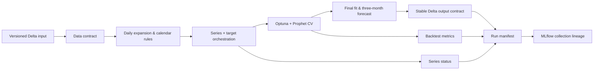

<div align="center">

# Prophet Forecasting MLOps

### Production-grade batch time-series forecasting on Databricks

[](https://github.com/soulipaco/prophet-forecasting-mlops/actions/workflows/ci.yml)


Evidence-led architecture · Reproducible forecasting · MLflow lineage · Serverless Databricks

</div>

---

## The project

This repository implements a maintainable forecasting platform for coordinated Prophet model collections. Forecasting behavior lives in ordinary testable Python, while Spark/Delta IO, MLflow tracking, and deployment stay behind clear Databricks boundaries.

The system trains one model per series and target, evaluates time-aware cross-validation, generates three-calendar-month forecasts, and publishes stable versioned outputs through a serverless Databricks job.

## Verified outcome

| Check | Result |
|---|---:|
| Automated tests | **10 passing** |
| Databricks environments | **dev, acc, prd deployed** |
| End-to-end dev smoke run | **successful** |
| Synthetic model fits | **4 completed, 0 failed** |
| Persisted smoke outputs | **832 forecast rows, 84 backtest rows** |

The cloud smoke test uses deterministic synthetic time series so the project can be evaluated without external data dependencies.

## Architecture



Forecasting logic is independent of Spark. Databricks-specific behavior is confined to the IO boundary, MLflow integration, and deployment resources.

## Design decisions that matter

- **Batch over online serving:** the source produces forecast tables and has no request-time consumer.
- **A coordinated model collection:** current scale implies 25 series × 2 targets, while one registered model per fit would create unnecessary operational overhead.
- **Behavioral stability:** logistic growth, seasonality, regressors, holidays, adaptive CV, Optuna search, and three-calendar-month horizons are covered by explicit module boundaries and tests.
- **Stable forecast schema:** internal Prophet component columns are excluded from Delta contracts; point estimates, intervals, bounds, horizon, row type, lineage, and series keys remain.
- **Idempotent retries:** writes replace the logical records for the same `run_id` before append.
- **Collection-level MLflow:** one bounded run captures configuration, source version, counts, metrics, and selected parameters.
- **No premature production schedule:** production source ownership, cadence, and promotion thresholds remain explicit activation gates.

## Repository map

```text
├── conf/                       # Validated base/dev/acc/prd configuration
├── docs/                       # Discovery, decisions, migration and traceability
├── resources/                 # Databricks job resources
├── scripts/                   # Thin Databricks entry points
├── src/forecasting_project/   # Reusable forecasting package
├── tests/                      # Unit tests and safe synthetic fixtures
├── databricks.yml             # Databricks Asset Bundle
├── pyproject.toml             # Package and tooling configuration
└── uv.lock                    # Reproducible dependency lock
```

## Core package responsibilities

| Module | Responsibility |
|---|---|
| `config.py` | Pydantic configuration and environment overlays |
| `contracts.py` | Input schema, uniqueness, type and cutoff validation |
| `preprocessing.py` | Daily expansion, closure inference and logistic bounds |
| `calendars.py` | Country-aware holiday construction |
| `splitting.py` | Source-equivalent CV windows and calendar horizons |
| `prophet_model.py` | Shared Prophet builder, Optuna objective, fit and CV |
| `evaluation.py` | Forecast accuracy and interval metrics |
| `orchestration.py` | Deterministic series/target collection execution |
| `tracking.py` | Config hashing, run manifests and MLflow lineage |
| `databricks_io.py` | Spark/Delta boundary and idempotent writes |

## Local validation

Prerequisites: Python 3.12 and [uv](https://docs.astral.sh/uv/).

```bash
uv sync --extra test
uv run ruff check src tests scripts
uv run ruff format --check src tests scripts
uv run pytest
uv build
```

## Databricks deployment

Authenticate with OAuth or workload identity—never commit a personal access token.

```bash
databricks auth login
databricks bundle validate -t dev -p dev
databricks bundle deploy -t dev -p dev
databricks bundle run -t dev -p dev forecasting_pipeline
```

The provided job bootstraps deterministic synthetic data for safe demonstration. Replace that task with an approved source-table contract before a real-data run. Acc/prd resources are deployed but intentionally unscheduled.

## Documentation

- [Target architecture and decision records](docs/target_architecture.md)
- [Excluded reference features](docs/excluded_reference_features.md)
- [Known limitations and open decisions](docs/known_limitations.md)

## Engineering standards

The project uses locked dependencies, Ruff, pytest, reproducible synthetic fixtures, GitHub Actions, environment-specific configuration, OAuth/workload identity, and idempotent run-level persistence. See [SECURITY.md](SECURITY.md) for credential and vulnerability reporting guidance.

## Project status

The dev, acceptance, and production bundles are deployed. Production activation requires the final source contract, retraining cadence, target-specific acceptance thresholds, and ownership of promotion decisions.

Contributions are welcome through focused pull requests. Start with [CONTRIBUTING.md](CONTRIBUTING.md).
