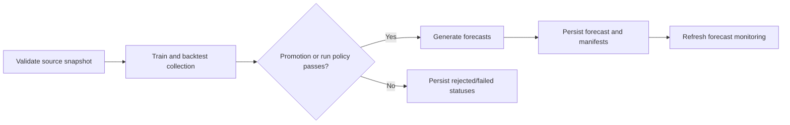

# Target architecture

## Design objective

Build the smallest production-capable batch forecasting system that preserves the current notebook mathematics, makes behavior testable, records lineage, and can run as a Databricks job. The design intentionally excludes online serving, one-registry-entry-per-series, classifier concepts, and infrastructure that has no evidence-backed consumer.

## Proposed project structure

The final root will be created only after `<TARGET_PROJECT_PATH>` is confirmed.

```text
<TARGET_PROJECT_PATH>/
├── databricks.yml
├── pyproject.toml
├── uv.lock
├── README.md
├── conf/
│   ├── base.yml
│   ├── dev.yml
│   ├── acc.yml
│   └── prd.yml
├── resources/
│   └── forecasting_job.yml
├── scripts/
│   ├── validate_input.py
│   ├── train_and_backtest.py
│   ├── generate_forecasts.py
│   ├── persist_results.py
│   └── monitor_forecasts.py
├── src/forecasting_project/
│   ├── config.py
│   ├── contracts.py
│   ├── domain.py
│   ├── preprocessing.py
│   ├── calendars.py
│   ├── splitting.py
│   ├── prophet_model.py
│   ├── tuning.py
│   ├── evaluation.py
│   ├── forecasting.py
│   ├── orchestration.py
│   ├── tracking.py
│   ├── persistence.py
│   ├── monitoring.py
│   └── databricks_io.py
├── tests/
│   ├── fixtures/
│   ├── unit/
│   ├── parity/
│   ├── integration/
│   └── databricks/
├── sanitized_source/
│   └── forecasting_pipeline_anonymized.ipynb
└── docs/
    ├── anonymization_report.md
    ├── discovery_report.md
    ├── target_architecture.md
    ├── migration_plan.md
    ├── behavioral_baseline.md
    └── traceability.md
```

Names may be tightened during implementation, but module boundaries should change only if tests demonstrate a simpler equivalent.

## Responsibilities

- `config.py`: Pydantic models for environment, input/output table names, cutoff/horizon policy, series keys, target specifications, regressors, holidays, tuning, cross-validation, tracking, and failure policy. It contains no hostnames or credentials.
- `contracts.py`: pandas-level and Spark-boundary schema validation, uniqueness, date grain, required future regressor coverage, nullability, and target constraints.
- `domain.py`: immutable identifiers and result types such as `SeriesKey`, `TargetSpec`, `SeriesResult`, and failure/status enums.
- `preprocessing.py`: daily expansion, identifier restoration, zero-fill, exclusions, cap/floor derivation, and construction of Prophet frames. Parity behavior is explicit and side-effect-free.
- `calendars.py`: country holiday generation, holiday windows, and non-operating-weekday inference.
- `splitting.py`: current adaptive Prophet CV windows plus explicit rolling-origin fold materialization and horizon buckets.
- `prophet_model.py`: one model-construction function used by both tuning and final fitting; serialization helpers are isolated here.
- `tuning.py`: deterministic Optuna study creation, search space, failure capture, and resource limits.
- `evaluation.py`: notebook-parity RMSE plus baseline, MAE/WAPE or sMAPE, bias, interval coverage, interval width, and horizon-bucket aggregation.
- `forecasting.py`: future-frame construction, regressor join, completeness checks, prediction, output schema, and historical/future row typing.
- `orchestration.py`: loops over the 25 series and two targets, coordinates parent/series results, and applies the configured fail-fast or continue-and-record policy.
- `tracking.py`: MLflow parent run, nested or artifact-based series records, dataset/code/config lineage, metrics, and optional model collection manifest.
- `persistence.py`: idempotent Delta writes and merge/replace rules for forecast, backtest, run, and series-status tables.
- `monitoring.py`: data freshness/completeness and post-actual forecast accuracy calculations. It does not parse serving payloads.
- `databricks_io.py`: the only package module that requires Spark/Databricks APIs; loads source snapshots and persists managed tables.
- `scripts/`: argument parsing and dependency wiring only. They do not contain forecasting mathematics.

## Databricks-specific versus ordinary Python

Ordinary Python owns all forecasting behavior from a pandas input frame through model results. These modules must run locally: configuration validation, contracts, preprocessing, calendar logic, split construction, Prophet construction, tuning, evaluation, prediction, and orchestration over in-memory frames.

Databricks-specific code is limited to Spark/Delta input and output, Unity Catalog names and permissions, MLflow tracking/registry calls, job task values, Asset Bundle definitions, and workspace authentication. Tests import ordinary modules without Spark. Databricks integration tests are marked and run separately.

## Configuration boundaries

`base.yml` defines behavior shared across environments. Environment overlays define only catalog/schema/table references, experiment path, schedule state, and resource sizing. Command-line/job parameters provide run-specific values such as `as_of_date`, `run_id`, git SHA, branch, and optional trial budget.

The following values must not appear in Python source: catalog/schema/table names, source paths, output locations, experiment names, schedule/cadence, cluster/serverless settings, trial count, cutoff date, threshold, forecast months, series fields, target fields, regressor fields, holiday policy, and failure mode.

Pydantic rejects unknown environments, missing fields, duplicate regressors, targets also used as regressors, invalid ratios/ranges, non-positive horizons/trials, and unsupported failure modes.

## Data contracts

### Input

Required logical fields are:

- `event_date`: daily timestamp/date.
- Three series identifiers corresponding to the two neutral business dimensions and language.
- Country code/name accepted by the holiday library.
- `Business_Category_003` target and KPI target.
- Three known-future regressors.
- The auxiliary field used by non-operating-day detection.
- Optional normal/bound metadata currently read by the notebook but unused.

The migration layer initially maps these logical names to sanitized source columns. Production table names and business names remain external configuration.

Validation checks required columns, date coercion, one row per series/date, consistent country per series, non-null historical targets, numeric target/regressor types, sufficient positive volume for the logistic floor, future-regressor completeness for every requested forecast date, and deterministic ordering. It reports all violations with neutral series keys.

### Outputs

`forecast_rows` contains run ID, as-of date, series key, target name, forecast date, horizon day, row type (`fitted` or `future`), `yhat`, `yhat_lower`, `yhat_upper`, cap/floor, model/config version, and creation timestamp.

`backtest_rows` contains fold cutoff, forecast date, horizon day/bucket, actual, point/bounds, metric contributions, baseline prediction, and series/target/run identifiers.

`series_status` contains one row per series/target with status, stage, neutral reason code, row counts, date coverage, chosen parameters, artifact URI, duration, and retryability.

`run_manifest` contains source table/version, code SHA, package version, configuration hash, as-of date, expected/completed/failed counts, aggregate metrics, promotion decision, and output table versions.

All tables are keyed so rerunning the same run ID is idempotent.

## Training, forecasting, and backtesting entry points

- `validate_input.py` resolves the source snapshot and creates a validation manifest. It fails before expensive fitting when the global contract is invalid.
- `train_and_backtest.py` materializes folds, computes baselines, tunes and fits series models, records metrics/statuses, and writes a model collection manifest. The parity profile uses the notebook's adaptive windows, 50 trials, RMSE objective, and model settings.
- `generate_forecasts.py` loads the models from the same run context (or uses freshly fitted objects in a combined task), validates future regressors, and emits the 92-day/calendar-three-month forecast rows.
- `persist_results.py` commits results atomically or by deterministic merge after verifying expected counts.
- `monitor_forecasts.py` joins forecasts to newly arrived actuals and refreshes monitoring aggregates.

For the smallest initial deployment, training/backtesting/forecasting may be one job task invoking one orchestration entry point, followed by a separate persistence task. The modules remain separate even if the task graph is compact.

## Evaluation and baselines

The first parity milestone reproduces Prophet `cross_validation` and mean RMSE. New evaluation is added alongside, not substituted silently:

- Seasonal-naive lag-7 baseline, justified by daily data and weekly seasonality.
- MAE and RMSE for both targets.
- WAPE where the aggregate denominator is non-zero; sMAPE only after confirming its behavior on low-volume dates.
- Mean signed error/bias.
- Empirical coverage and average width for the configured 80% interval.
- Metrics by target, series, and horizon buckets 1-30, 31-60, and 61-92 days.

Promotion compares challenger and approved collection on identical folds and against the seasonal-naive baseline. A candidate cannot promote when required series fail, required future regressors are incomplete, interval coverage is below a configured guardrail, or aggregate improvement hides a material series regression. Exact thresholds remain configuration placeholders until business owners confirm them.

## Experiment tracking and artifacts

Use one MLflow parent run per forecast execution. Log code SHA, branch, package version, config hash, source table and Delta version, as-of date, series count, target count, horizon, and aggregate results. Per-series parameters/metrics are stored in structured Parquet/JSON artifacts and the Delta status/backtest tables; nested runs are optional and capped to avoid noisy tracking.

Prophet models remain individual in memory. If models must be reused, serialize each beneath a collection artifact path and record it in `model_manifest.json`. Do not create 50 registered-model names. Registration is initially optional because the production interface is forecast tables. If governance requires a registered object, register one model-collection version and point `Champion`/`Challenger` aliases at collection versions.

## Deployment and scheduled execution

Use a Databricks Asset Bundle to build/install the wheel and define a batch job. Proposed task order:



All environment schedules remain paused until cadence is confirmed. No Model Serving resource is created.

## Monitoring

Pre-run monitors:

- Source freshness and row-count change.
- Expected versus observed series.
- Duplicate series/date keys.
- Historical target and future-regressor completeness.
- Training span and positive-volume sufficiency.

Run monitors:

- Expected/completed/failed series-target counts.
- Runtime and trial-failure rate.
- Forecast row counts by horizon and missing-date checks.
- Parameter/search-space version and artifact availability.

Post-actual monitors:

- RMSE, MAE, WAPE/sMAPE where valid, bias, interval coverage, and interval width by target, series, and horizon bucket.
- Challenger versus champion and seasonal-naive deltas.
- Repeated failures or sustained degradation that can trigger a retraining recommendation.

Retraining triggers remain advisory until cadence and approval authority are confirmed. Data drift alone is not used as a promotion trigger.

## CI/CD

CI on pull requests:

1. `uv sync --extra test` using the lock file.
2. Secret/private-key, YAML/TOML/JSON, Ruff lint/format, and notebook-output checks.
3. Unit, contract, split/leakage, metric, schema, and parity tests.
4. A lightweight Prophet integration test on deterministic synthetic data with fixed seeds and tolerances.
5. Wheel build and Asset Bundle validation without deployment.

Databricks integration tests run in a protected environment and validate table IO, MLflow lineage, job parameters, and idempotent persistence. CD deploys dev automatically if desired, then acceptance, then production only after the configured validation/promotion and environment approval. Git tagging occurs once after successful production deployment, not during PR CI.

## Environment and secrets management

Use uv for local reproducibility and a wheel for Databricks. Pin Prophet, Optuna, pandas, holidays, Pydantic, MLflow, and compatible transitive dependencies after verifying the target Databricks runtime. Spark/Databricks packages may be provided by the runtime and declared only in the appropriate development/test extras.

Authentication uses Databricks workload identity/service principals and GitHub environment secrets. Runtime secrets use Databricks secret scopes only when an external system is genuinely required. No token, host, username, `.env`, or original anonymization mapping is stored in the project.

## Logging and failure recovery

Use standard structured logging with run ID, series-key hash/neutral alias, target, stage, fold, trial, and duration. Do not log raw business names or data rows. Capture warnings as diagnostics instead of suppressing them globally.

Every expensive stage writes or updates a series status. A retry with the same run ID skips completed idempotent units and retries only retryable failures. Partial model artifacts remain quarantined until the run policy passes. Persistence writes to staging and commits/merges only after schema/count validation. Job-level retries are bounded; deterministic data-contract failures are not retried.

## Reproducibility

Persist code SHA, package/lock hash, config hash, input table/version, as-of date, timezone, Prophet/Stan versions, Optuna seed/sampler, fold definitions, selected parameters, cap/floor, holiday calendar version, expected series list, and output table versions. The parity profile preserves current unseeded behavior only long enough to characterize it; deterministic seeds are introduced as a documented behavior change with tolerance-based comparison.

## Architectural decision records

| Decision | Evidence | Alternatives considered | Selected approach | Trade-offs | Migration impact |
|---|---|---|---|---|---|
| Production interface | Notebook writes six batch tables/files; no latency consumer | Online endpoint; batch tables; both | Batch Delta tables | No request-time inference; much simpler operations and lineage | Replace CSV writes with versioned managed tables. |
| Model unit | 25 series x 2 targets; individual Prophet fits | Model per series; model per KPI; one opaque global model; collection | Individual fits coordinated as one run/collection | Keeps local specialization without registry explosion | Add manifest/status tables and collection orchestration. |
| Registration | No downstream model loading evidence | 50 registered models; one collection; artifacts only | Artifacts plus manifest; optional one collection registration | Less registry-native per-series governance; lower operational burden | Registration deferred until a consumer requires it. |
| Evaluation | Mean RMSE only; three-month horizon; future actuals exist | Single aggregate RMSE; target-specific rolling metrics | Parity RMSE plus horizon/target metrics and baseline | More tables and policy decisions; materially safer promotion | Add folds, baseline, interval and bucket metrics without changing first fit. |
| Failure policy | One exception stops notebook; short-history path broken | Always fail; always skip; configurable | Fail-fast parity, explicit continue-and-record production mode | Two policies require tests; preserves behavior before improvement | Introduce status types before changing operational behavior. |
| Storage | Local Excel/CSV; Databricks target implied | Files; MLflow artifacts only; Delta tables | Delta result/status tables plus MLflow lineage/artifacts | Requires UC contracts and permissions | Source/destination names must be confirmed. |
| Orchestration | One large function; reference uses DAB tasks | Replacement notebook; monolithic script; package plus thin tasks | Package plus thin DAB tasks | Slightly more files; far better testability | Extract cell behavior incrementally with parity tests. |
| Monitoring | None; reference classifier payload monitor is mismatched | Reuse classifier monitor; feature drift only; forecast-aware | Forecast completeness and residual monitoring | Actuals arrive later, so monitoring is delayed by horizon | Add forecast/actual reconciliation task and tables. |
| Schedule | Three-month horizon but no cadence | Weekly reference schedule; monthly; manual | Configurable, paused until confirmed | No automatic production run initially | Deployment can be validated safely before activation. |
| Weekly terms | Built-in weekly plus custom weekly | Remove one; retain both | Retain both in parity profile | Possible collinearity/complexity remains | Evaluate as a challenger only after parity. |
| Future regressors | Source contains post-cutoff rows; missing rows are dropped | Impute; extrapolate; fail contract; drop | Preserve drop in parity, require completeness status in production | May reject runs that notebook partially emits | Adds preflight visibility; no silent imputation. |
